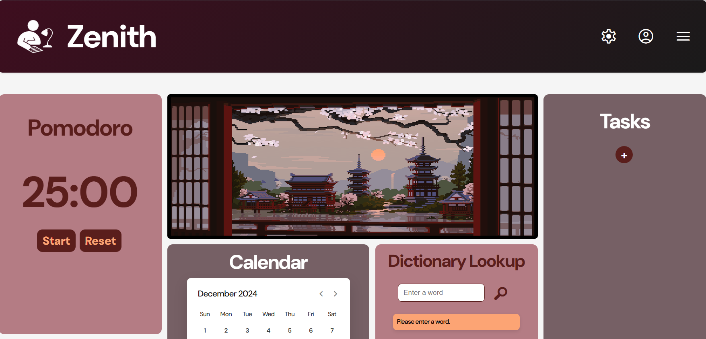
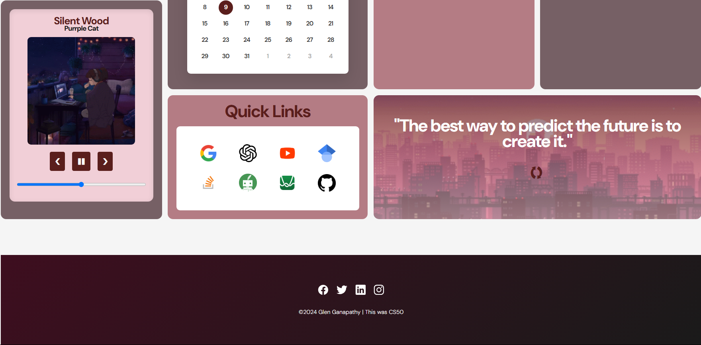

# Zenith | Focus. Learn. Achieve.

Zenith is a multi-functional productivity web application designed to help you focus, learn, and achieve your goals. It combines various tools such as a calendar, Pomodoro timer, task list, dictionary lookup, and more into a single user-friendly interface.

## Features

- **Interactive Calendar**  
  Keep track of dates with an intuitive, dynamic calendar.

- **Pomodoro Timer**  
  Boost productivity using a simple 25-minute Pomodoro timer with pause and reset functionalities.

- **Task Manager**  
  Add, complete, and delete tasks while saving them locally in your browser.

- **Dictionary Lookup**  
  Search for word definitions using the Dictionary API.

- **Quick Links**  
  Access frequently used websites like Google, YouTube, and Stack Overflow with a single click.

- **Quotes for Inspiration**  
  Get randomly displayed motivational quotes to keep you inspired.

- **Lofi Music Player**  
  Relax and focus with a music player featuring preloaded tracks.

## Installation

1. Clone the repository:
   ```bash
   git clone https://github.com/yourusername/zenith.git
   ```

2. Open `index.html` in your preferred browser to run the app locally.

## How to Use

1. **Calendar**  
   Navigate through months using the left and right arrows. Click on dates for more.

2. **Task Manager**  
   - Add tasks by clicking the `+` button.
   - Complete tasks by clicking the checkmark.
   - Delete tasks using the cross icon.

3. **Pomodoro Timer**  
   Start, pause, or reset the timer with the respective buttons.

4. **Dictionary Lookup**  
   Enter a word in the input box and click the search icon to view definitions.

5. **Quick Links**  
   Click on the logos to navigate to external tools like Google, ChatGPT, YouTube, and more.

6. **Quotes Section**  
   Refresh quotes using the refresh button.

7. **Lofi Music Player**  
   Play, pause, skip, and rewind tracks. Adjust progress using the slider.

## Technologies Used

- **HTML5** for structure
- **CSS3** for styling
- **JavaScript** for interactivity
- **External APIs**:
  - [Dictionary API](https://dictionaryapi.dev/)

 ## Screenshots



## I worked on this project as part of my "CS50's Introduction to Computer Science" Final Project.
